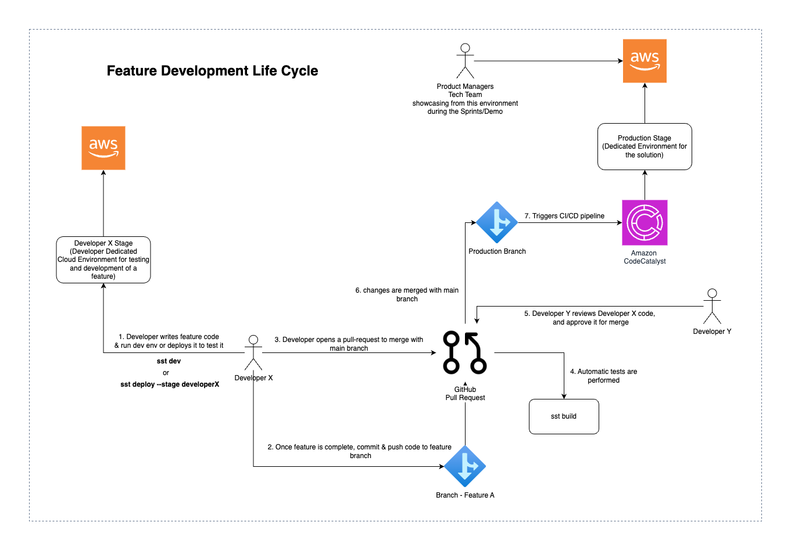
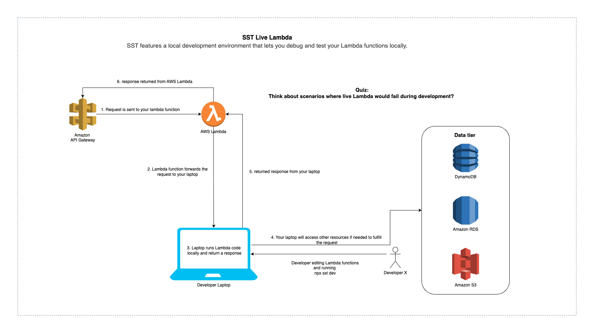

# Sample React.js SST app

An example full-stack serverless React.js app created with SST.

This sample also includes Amazon CodeCatalyst and GitHub workflow (CD pipelines) to deploy changes of the main branch to AWS automatically. As well as additional checks that can be enabled to protect the main branch, require PR reviews, require build to pass before merge, perform secrets scanning on the repository and prevent secrets from being pushed to GitHub.

This stack assumes and requires that you deploy the __prod__ SST stage first, which includes a relational database. Other non-prod stages refernce that relational database instead of creating their own. See [DBStack.ts](./stacks/DBStack.ts) for more details. 

The template was designed this way to be __educational and to demonstrate the use of different stages (prod,dev,test) while keeping a single database for cost saving and simplification__ to be shared between them all. It is important to note that this is not a recommended setup for production uses. 

## Steps to get started (one time per repo)

At a high level, these are the steps you need to take to use this template:

1. Create a repository out of this template (Click the green button!)
1. Decide between Amazon CodeCatalyst or GitHub workflows for CI/CD
    1. Configure the selected workflow
1. Start developing and testing

Checkout the relevant sections below for the detailed steps in each.

## Decide between Amazon CodeCatalyst or GitHub workflows for CI/CD

### Amazon CodeCatalyst
This template includes a sample workflow definition under the speical [.codecatalyst](.codecatalyst) root folder in the following structure.

```md
.codecatalyst
    ├── imagebuilder            (1)
    │   ├── docker.yaml
    │   ├── git.yaml
    │   └── node.yaml
    ├── scripts                 (2)
    │   └── sst_deploy.sh
    └── workflows               (3)
        └── DeployToProd.yaml
```

(1) contains Amazon EC2 ImageBuilder componenet configuration files that tell ImageBuilder how to install docker, git and nodejs. These files are used as part of the `devops-coca` stage to create a container image that will be used by Amazon CodeCatalyst workflows to build and deploy your SST application.

(2) contains the build script that will run as part of the Amazon CodeCatalyst workflow.

(3) contains the workflow (pipeline) defenition of the Amazon CodeCatalyst workflow that will trigger based on pushes/changes to the main branch and deploy those changes to AWS.

In addition, the [ImageBuilderForCodeCatalyst.ts](stacks/devops/ImageBuilderForCodeCatalyst.ts) stack provides an automation that deploys the Amazon ImageBuilder container recipe and pipeline, as well as a private Amazon Elastic Container Registry (ECR) that will host the build image.

#### Configuration steps for Amazon CodeCatalyst

0. Delete the `.github` folder to disable/remove GitHub workflows

1. Deploy the "devops-coca" stage

```bash
npx sst deploy --stage devops-coca
```

This will deploy the imagebuilder pipeline and all the other resources specified in the stack in order to build the base image.

2. Get the name of the Amazon ECR repository

Access the AWS Console and navigate to the Amazon ECR console.
You will need to find the name of the ECR repository that was just created.
You can also use Amazon CloudFormation to find the stack and check the resources tab of the stack to find the ECR repository resource name.

3. Create a new Amazon CodeCatalyst space at [http://codecatalyst.aws](http://codecatalyst.aws) [(docs)](https://docs.aws.amazon.com/codecatalyst/latest/userguide/spaces-create.html)

4. Create a deploy environment in Amazon CodeCatalyst and associate the account connection and IAM roles to your deploy environment [(docs)](https://docs.aws.amazon.com/codecatalyst/latest/userguide/ipa-connect-account-addroles-env.html)

5. Install the GitHub repositories extension in Amazon CodeCatalyst [(docs)](https://docs.aws.amazon.com/codecatalyst/latest/userguide/extensions-github-extension-quickstart.html)

6. Trigger Amazon EC2 Image Builder to build the container image

Visit the Amazon EC2 Image Builder console, find the pipeline, and trigger it to build the image. Wait for the image to be built and pushed to ECR, then take note of the image URL.

7. Update [DeployToProd.yaml](.codecatalyst/workflows/DeployToProd.yaml) with the container image URL from ECR and the deploy environment name and IAM role

This can be done from the CodeCatalyst console or by modifying the yaml file directly.


Once all of these steps are done, Amazon CodeCatalyst workflow should be able to run successfully and deploy the sample SST application to the configured AWS account.  

### GitHub Workflow

This template includes two sample workflow definitions under the speical [.github](.github) root folder in the following structure.

```md
.github
    └── workflows
        ├── build-test.yaml             (1)
        └── deploy-on-push-main.yaml    (2)
```

(1) contains the workflow definition to trigger a build check to confirm that the code can build sucessfully for every pull request. As the PR is reviewed and more commits are added, the ci workflow will rebuild to ensure that the code is stable and safe before allowing a merge.

(2) contains the workflow definition to trigger a deployment to `--stage prod` on any commits/push to the main branch, including direct commits and merges.

Additional checks can also be enabled to protect the main branch, require PR reviews, require build to pass before merge, perform secrets scanning on the repository and prevent secrets from being pushed to GitHub. Details are in the config steps section below.

In addition, the [OIDCForGitHubCI.ts](./stacks/devops/OIDCForGitHubCI.ts) stack provides an automation that deploys the OIDC identity provider that allows GitHub workflows from your repository to access your AWS account for deployment. See [SST - Going to Production](https://docs.sst.dev/going-to-production#stacks-setup) if you would like to understnad more about it.

#### Configuration steps for GitHub Workflow

1. Pre-requisite for using SST
    - Install AWS CDK NPM package 

    ```bash
    npm i aws-cdk-lib
    ```
    - Ensure that [Docker](https://docs.docker.com/engine/install/) is installed on your machine 

2. Update [OIDCForGitHubCI.ts](./stacks/devops/OIDCForGitHubCI.ts) [line 12](./stacks/devops/OIDCForGitHubCI.ts#L12), and [line 13](./stacks/devops/OIDCForGitHubCI.ts#L13) with your organization/repository and repository name respectively.

2. Deploy the "devops-gh" stage

```bash
npx sst deploy --stage devops-gh
```

This will deploy the Open ID Connect (OIDC) identity provider in your account.

3. Update the `role-to-assume:` and `aws-region:` attributes in both workflow yaml files to use the role created by the deployed stack. If you do not change the default values, the role name will be GitHub, and so only the AWS account ID will need to be updated in the yaml definition.

```
build-test.yaml
deploy-on-push-main.yaml
```

4. (Re)Trigger a run of the workflows from the `actions` tab to report status checks of each workflow 

    1. Create a branch and perform some changes
    2. Create a test/dummy PR to trigger the ci build test workflow.

__This inital run is needed to be able to select the status check as part of the branch protection to prevent PR merges on branches that do not pass the build check (ci).__

5. Enable branch protection, Require Pull Request and Reviews

Go to `Settings`>`Branches`>`Add rule`

- Branch name pattern: main
- Require a pull request before merging: Checked
- Require approvals: Checked
- Dismiss stale pull request approvals when new commits are pushed: Checked
- Require status checks to pass before merging: Checked
- Require branches to be up to date before merging: Checked
    - Search for `Build Check` as a status check and select it. if it is not found try starting a PR to trigger the ci workflow and then try again after the workflow is done running once.

`Save Changes`

6. Enable secret scanning and push protection

Go to `Settings`>`Code security and analysis`>

- Secret scanning: Enable
- Push protection: Enable

## Start developing and testing

Update the line `name: "codecatalyst-sst-app"` in `sst.config.ts` with the name of your application, this will be prefixed to all resources and the Amazon CloudFormation stacks created.

To install dependencies and run your own development environment of the app.

```
npm install
npm run dev
```

### Understanding the project structure

```md
codecatalyst-sst-app
    ├── README.md                                   (1)
    ├── db.dbml                                     (2)
    ├── docs                                        (3)
    │   ├── 01-context.md
    │   ├── 02-deployment-architecture.md
    │   ├── 03-api-defenition.md
    │   ├── 04-db-schema.md
    │   └── diagrams
    │       ├── app-dev-lifecycle.drawio
    │       └── app-dev-lifecycle.drawio.png
    ├── packages
    │   ├── core                                    (4)
    │   ├── db-migrations                           (5)
    │   │   ├── migrationsV1.mjs
    │   │   └── migrationsV2.mjs
    │   ├── frontend                                (6)
    │   │   ├── README.md
    │   │   ├── package.json
    │   │   └── ...
    │   └── functions                               (7)
    │       ├── src
    │       │   ├── lambda.ts
    │       │   └── sample-python-lambda            (8)
    │       │       ├── lambda.py
    │       │       └── requirements.txt
    │       └── ...
    ├── sst.config.ts
    ├── stacks                                      (9)
    │   ├── ApiStack.ts
    │   ├── DBStack.ts
    │   ├── FrontendStack.ts
    │   └── devops
    │       ├── ImageBuilderForCodeCatalyst.ts
    │       └── OIDCForGitHubCI.ts
    └── ...
```

1. This README file
2. A file to represent and store the schema of your projects relational DB, for more info see [DBML](https://dbml.dbdiagram.io/home/#dbdocs)
3. Hosts markdown documentation of your project, feel free to explore and evolve as needed.
4. Hosts common typescript code that can be used across many lambda functions
5. Contains sql-like instructions to execute on the relational DB after deployment
6. Contains the React.js frontend site, the subfolder are mostly pure react project. You are encouraged to look at the sub README for more info.
7. Contains the lambda functions code, wheather in typescript or python, can be organized in sub folders per function, etc.
8. A sample folder for a single python lambda function, this is required for lambda functions as they need to have a requirements.txt file in the same directory as the python code
9. Contains the application's SST stacks that define all of the infrastructure that needs to be created, also includes the stackes used by the DevOps stages

### Now Go Build!

## Helpful Commands

### `npm run dev`

Starts the SST Live Lambda Development environment.

### `npm run build`

Build your app and synthesize your stacks.

### `npm run deploy [stack]`

Deploy all your stacks to AWS. Or optionally deploy, a specific stack. (You should not need this if you have the pipeline deploying to prod, and you using `npm run dev` for your development work.)

The main caveat where you may need to use `deploy` instead of `dev` is if you want to test your application without the Live Lambda feature (hosting Lambda's in AWS instead of proxying them to your laptop, which is what happens in `npm run dev`. [See this for more info on Live Lambda](https://docs.sst.dev/live-lambda-development#how-it-works).) 

### `npm run remove [stack]`

Remove all your stacks and all of their resources from AWS. Or optionally removes, a specific stack.

## Documentation

Learn more.

- [SST Docs](https://docs.sst.dev/)
- [sst cli](https://docs.sst.dev/packages/sst)
- [dbdocs](https://dbdocs.io/docs) (Used to host DB documentation.)

## Application/Feature Development Life Cycle 

The figure below shows the typical application/feature devlopment workflow that you can follow. Exchange CodeCatalyst with GitHub if that is what you are using.



## Live Lambda Development  

The figure below shows the an SST features called Live Lambda which allows you to debug and test your Lambda functions locally.


